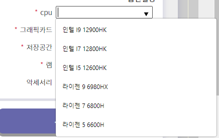
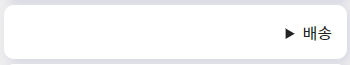
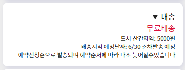

# capstone22
### 프로젝트명: smart shop
##### 팀명: SMART
##### 박민형 - 팀장 / 최주선 - 팀원
##### 팀 작업 깃허브 URL (필수) : https://github.com/guiltygear12/capstone-project-smart
##### 작품 소개 사이트 URL (필수):  https://sproutj.github.io/intro-smart/
##### 개인 포트폴리오 URL: --
##### 개발환경: ADOBE XD, VS CODE, PHOTOSHOP, HTML, CSS, JS, JQUERY
##### 작품특징: 노트북을 메인으로 하여 다양한 고객층에 적합한 노트북을 판매하는 웹 쇼핑몰입니다

## 5월 8일
>제품상세페이지 작업 종료

상세페이지 작업이 종료되어 마이페이지작업이 진행될 예정
마이페이지 구성은
- 장바구니
- 주문내역 (배송확인)
- 구매한 상품 관리 (보증기간확인및 관리기능)
- 예약관리 (AS,상담,방문 예약 확인)

전체적인 기본 프레임은 같아서 이전보다 빠른 작업이 진행될거같다

##### 추가작업일지 

마이페이지 4개의 페이지를 묶어서 작업이 종료 되었다
리엑트/뷰를 사용하지 않기때문에 완전한 싱글페이지는 만들수없었지만
제이쿼리와 css를 잘 사용하여 페이지 이동없이 내용만 바꿔서 화면전환 하는것에 성공하였다

코드는 다음과 같다 

```js
// 마이페이지 왼쪽에 목록을 클릭하게되면
$(".my_page_list>h3").click(function(){
    // 해당 목록이 선택되며 밑줄이 그어진디
    $(this).addClass("active")
    $(this).siblings().removeClass("active")
//  조건문 - 어떤 메뉴에 active 클래스가 포함되어있는지 확인후
//  해당 목록에 맞는 콘텐츠 wrap에게 active 클래스를 추가하여 보이게 된다
    if($(".my_page_list>h3#barsket.active").length) {
        $('.my_page_right_title>h2').text("장바구니")
        $('.barsket_wrap').addClass("active")
        $('.barsket_wrap').siblings().removeClass("active")
    } else if($(".my_page_list>h3#order.active").length) {
        $('.my_page_right_title>h2').text("주문내역")
        $('.order_wrap').addClass("active")
        $('.order_wrap').siblings().removeClass("active")
    } else if($(".my_page_list>h3#product.active").length) {
        $('.my_page_right_title>h2').text("구매한 상품 관리")
        $('.product_wrap').addClass("active")
        $('.product_wrap').siblings().removeClass("active")
    } else if($(".my_page_list>h3#as.active").length) {
        $('.my_page_right_title>h2').text("A/S 예약관리")
        $('.as_wrap').addClass("active")
        $('.as_wrap').siblings().removeClass("active")
    }
})
```

## 5월 4일
> 주간목표설정

- 현재 XD작업은 완성에 가까워 졌음 사용할 이미지 수집및 편집과정을 끝나면 디자인 작업은 종료될 예정
- 웹 작업은 상세페이지작업이 종료되면 마이페이지 방향을 작업할 예정


## 5월 3일
> 제품 상세페이지작업 진행중

제품상세페이지 작업이 진행중이며 

영역구분
1. 제품 구매및 이미지영역
    -완료
2. 상세정보
3. 제품 상세스팩
4. 사용자 리뷰
5. 구매시 유의사항

목요일까지 작업을 끝내고 오류를 없에는것을 목표로 진행중

오늘 사용된 새로운 문법

```html
<label for="cpu"><label style="color: crimson;">*</label>cpu</label>
    <input type="text" list="cpu_options" />
    <datalist id="cpu_options">
        <option value="인텔 I9 12900HK" />
        <option value="인텔 I7 12800HK" />
        <option value="인텔 I5 12600HK" />
        <option value="라이젠 9 6980HX" />
        <option value="라이젠 7 6800H" />
        <option value="라이젠 5 6600H" />
    </datalist>
```
#### 결과화면


>간단한 html 코드 만으로 검색창이나 선택사항같은 느낌을 낼수있는 코드입니다

<hr>

```html
<details class="notice">
    <!-- 누르기전에 보이는 글씨 -->
    <summary>배송</summary>
    <!-- summary 아래에 나오는 코드는 summary를 누르면 나오게 됩니다. -->
    <div>무료배송</div>
    <div>도서 산간지역: 5000원</div>
    <div>배송시작 예정날짜: 6/30 순차발송 예정</div>
    <div>예약신청순으로 발송되며 예약순서에 따라 다소 늦어질수있습니다</div>
</details>
```
#### 결과화면




>버튼을 누르면 자세한내용을 보여주는 메뉴를 손쉽게 js 없이 만들수있는 코드입니다.


## 4월 30일

메인페이지 완성되었음
제품 분류페이지 상단 배너 이미지에 슬라이더를 추가할것인지는 추가 논의가 필요할거 같다  

오류
>제이쿼리 작업중 즐겨찾기 버튼을 만들고 있었는데 1번의 제품의 즐겨찾기를 누르면 2,3번 제품도 같이 클릭됨

해결방법

```javascript
$('.wish_btn').click(function(){
    $('fa-bookmark').toggleClass('active')
    $('fa-bookmark-o').toggleClass('active')
    // 빈하트를 클릭하면 겹쳐져있던 하트가 나타나게하려고함
    // 하지만 클릭한제품이외의 제품도 같이 작동되는 버그가 나타남
})
    // 해결
$(".wish_btn").click(function(){
    $(this).children(".fa-bookmark").toggleClass("active");
    $(this).children(".fa-bookmark-o").toggleClass("active");
})
    // 제이쿼리에서 자식선택자를 활용하여 클릭된 영역에만 
    // 적용될수 있도록 지정함 
    
```

## 4월 27일(수)
>현재 진행사항
>메인페이지 90% -> 전체적인 작업은 완료 컬러변경작업및 완성된 이미지 파일만 삽입하면 끝
> 제품 분류페이지 -> 상세페이지 -> 상담페이지(예정) 순서로 작업예정

메인컬러를 정하였음 
 #6667AB


## 4월 13일
주간 목표설정
메인페이지 제작을 완료하였지만 메인페이지 좌우 영역이 많이 비어 보이는것에 대한 보안점이 필요하다는것을 느낌
메인페이지 배경색상및 컨텐츠 영역크기를 조종할 필요가 있다고 생각됨

메인메뉴
    제품
        비즈니스
        크리에이터
        게이머
    다운로드
        없음
    고객지원
        온라인 상담
        AS 문의
        FAQ(자주묻는 질문)
    오프라인매장
        매장 위치
        예약 상담

앞으로 진행할 페이지는
    제품 분류 / 제품 상세페이지
    다운로드 페이지 / 온라인 상담 + AS 페이지 / FAQ
    오프라인 매장 안내 페이지
    로그인 페이지 / 마이페이지
    를 진행할 예정이다


## 4월 8일
작업일지
일부 변경된 메인 페이지에대한 프레임 변경작업 및 2번째 컨텐츠 작업진행
할인,기획전 등의 이벤트에대해 소개해주는 영역을 제작하였음
크게 2개의 영역으로 나누어지며 우측에는 진행중인 이벤트의 썸네일이 보여지고
좌측에는 진행중인 이벤트의 주요 상품을 보여주는 영역입니다


## 4월 6일
회의 내용
메인페이지 컨텐츠를 일부 조정하였음
신제품 소개 -> 메인 슬라이드 와 컨텐츠가 많이 겹칠거 같아서 통합시켰음
공지시항및 이벤트 -> 디자인상으로 불필요하다고 판단되어 제거

xd 작업은 현재 제품 페이지/상세 페이지 작업중

중간고사 기간 이전까지해서 상세페이지영역까지 작업하는것을 목표로 잡았음


## 작성일 4월 5일
작업일지
금일 메인 페이지 매인 슬라이드 베너 작업을 마무리 하였습니다

로지텍 공식사이트의 메인 페이지를 참고하여 제작하였으며 넥스트 영역에 마우스 호버시에
다음 슬라이드가 보일수 있도록 디자인 되었으며 애니메이션은 끝났으며 슬라이드 영역 내부의
내용은 배너가 만들어진 뒤에 추가될 예정입니다.

다음 작업 부터는 스피드를 올려서 완성도를 높이는 방향으로 나아가야될거같습니다.

금일 오류사항
-제이쿼리 이벤트가 연결되지 않았음 
    -> 클래스 선택자 에서 .을 빼서 그런거였음
-transform sclae 을 사용하여 자연스럽게 줄어들고 늘어나도록 하였으나 줄어 들지 않음
    ->  else if 에서 꼬여서 switch case 로 변경후 문제가 사라짐 

이번주 수업 이후의 진행사항
> 메인 페이지에서 메인 컨텐츠 영역 완성하기  


## 작성일 4월 3일
진행사항
현재 XD작업 메인페이지 와이어프레임 작업된 사항을 전달받아서 HTML 기반작업 진행중입니다

중심이 되는 메인페이지에서 가지처럼 뻗어나가는 형태의 웹사이트로 진행될예정

기존에 브랜드 사이트로 생각하고 디자인을 진행하던것을 노트북 중심의 가상의 쇼핑몰을 만드는 방향으로 변경하여 진행하는것으로 아이디어가 일부 변경되었음

웹사이트는 좌우 여백 1280PX PC 기반으로 1차적으로 진행 시간여부에 따라서 스마트폰사이즈의 반응형으로 제작예정


## 3월 23일

#### 팀별 진행내용 (공통사항)
1. 자기가 속한 팀의 작품을 소개하는 깃허브 페이지를 제작할것
2. 사이트의 이름은 자유 (팀명,제품명등 상관없음)
3. 팀별로 사이트는 1개만
4. 본인의 포트폴리오로 사용할예정이라면 개인적으로 추가해도 무방

#### 개인별 진행내용
1. 깃허브 레포지토리 이름은 통일된 제목으로 정할것 < CAPSTONE22 > README.MD 파일 만들기

#### 리드미 파일 구성내용
팀명: 아무거나
이름: 아무개 (담당하는 파트및 팀장여부) / 팀원1 ()
졸업작품 소개 사이트: < 깃허브 사이트 URL >
포트폴리오 소개 사이트 : URL

#### 졸업작품소개
-작품명 : 
-개발환경 : 개발툴,도구 등등...
-작품 소개
-작품의 특징


